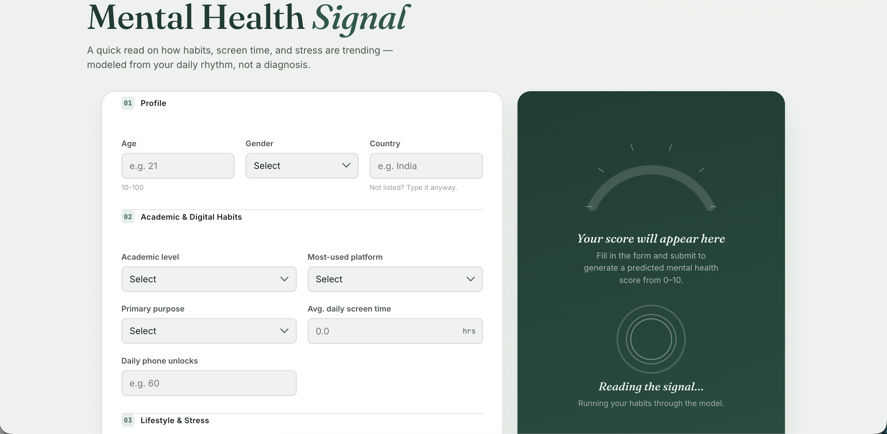
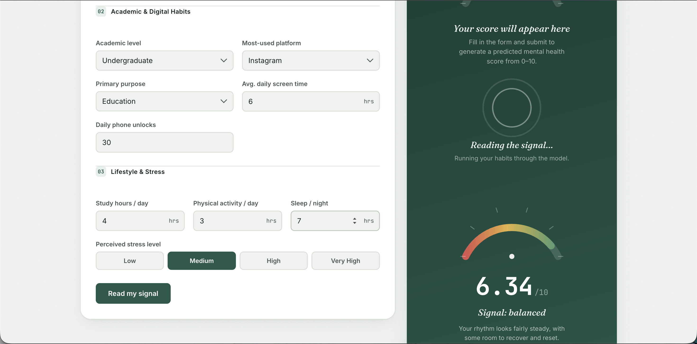

<div align="center">

# Mental Health Signal — Student Wellness Analytics

**A machine learning-powered web application that analyzes student social media habits to predict mental health impact.**

[](https://mental-health-score-1-xq8w.onrender.com)
[](https://www.python.org/)
[](https://fastapi.tiangolo.com/)
[](https://scikit-learn.org/)
[]()
[]()
[]()
[](https://opensource.org/licenses/MIT)
[](https://github.com/sumitjadhav1703/Mental_Health_Score/stargazers)
[](https://github.com/sumitjadhav1703/Mental_Health_Score/network/members)
[](https://github.com/sumitjadhav1703/Mental_Health_Score/commits/main)

</div>

<br/>

<details>
<summary>Table of Contents</summary>

- [Project Overview](#project-overview)
- [Why this project?](#why-this-project)
- [Live Demo](#live-demo)
- [Application Preview](#application-preview)
- [Features](#features)
- [Tech Stack](#tech-stack)
- [Project Structure](#project-structure)
- [Installation & Quick Start](#installation--quick-start)
- [API Documentation](#api-documentation)
- [Machine Learning Model](#machine-learning-model)
- [Deployment](#deployment)
- [Future Improvements](#future-improvements)
- [Contributing](#contributing)
- [License](#license)
- [Author](#author)

</details>

---

## 🎯 Project Overview

**Mental Health Signal** is a predictive analytics application designed to evaluate the impact of digital and lifestyle habits on student mental health.

By analyzing metrics like daily screen time, social media platform usage, sleep hours, and physical activity, this project generates a predicted mental health score using a tuned Machine Learning model.

It is designed for students, educators, and wellness researchers to better understand how daily lifestyle and technological choices correlate with mental well-being.

## 💡 Why this project?

With the increasing integration of social media into daily life, understanding its effect on mental health—especially among students—is critical. This project bridges the gap between raw behavioral data and actionable insights, providing an easy-to-use interface powered by an underlying Random Forest regression model to predict wellness scores based on survey-like inputs.

## 🌐 Live Demo

The application is deployed on Render and is accessible live:

👉 **[Launch Live Application](https://mental-health-score-1-xq8w.onrender.com)**

---

## 📸 Application Preview

Below are views of the application interface, demonstrating the input form and the resulting predictive analytics output.

### Prediction Form & Result Dashboard
<div align="center">
  
  <br/><br/>
  
</div>

---

## ✨ Features

Based on the implemented codebase, the application features:

- **FastAPI REST API:** A robust, high-performance backend serving the ML model.
- **Machine Learning Prediction:** Uses a tuned Random Forest regression model to generate mental health scores.
- **Input validation:** Strict runtime validation using Pydantic models for all demographic and behavioral inputs.
- **Responsive UI:** Custom HTML/CSS frontend with a clean, user-friendly form interface.
- **Health endpoint:** Live `/health` check route to monitor API status and model load state.
- **Live deployment:** Cloud-hosted using Render for public access.
- **CORS Handling:** Full Cross-Origin Resource Sharing support for flexible API consumption.

---

## 🛠 Tech Stack

| Domain | Technology | Description |
| :--- | :--- | :--- |
| **Frontend** | HTML5, CSS3, JavaScript | Custom built, responsive user interface and API integration |
| **Backend** | Python, FastAPI, Uvicorn, Pydantic | High-performance async REST API and data validation |
| **Machine Learning** | scikit-learn, pandas, joblib | Data preprocessing, Random Forest Pipeline, and model serialization |
| **Deployment** | Render | Cloud hosting for the application |

---

## 📁 Project Structure

```text
Mental_Health_Score/
├── main.py                                      # FastAPI application & API endpoints
├── index.html                                   # Frontend UI layout
├── style.css                                    # Frontend styling
├── script.js                                    # Frontend API integration logic
├── ML_Project.ipynb                             # Jupyter notebook for EDA and ML training
├── Mental_Health_Model.pkl                      # Serialized Random Forest prediction pipeline
├── Student Social Media And Mental Health Impact.csv  # Dataset used for training
├── requirements.txt                             # Python package dependencies
├── LICENSE                                      # MIT License
└── docs/
    └── screenshots/                             # UI preview images
        ├── home_page.png
        └── prediction_result.png
```

---

## 🚀 Installation & Quick Start

Follow these steps to run the project locally on Windows, macOS, or Linux.

### 1. Clone the repository
```bash
git clone https://github.com/sumitjadhav1703/Mental_Health_Score.git
cd Mental_Health_Score
```

### 2. Set up Virtual Environment
**Windows:**
```bash
python -m virtualenv venv
venv\Scripts\activate
```

**macOS / Linux:**
```bash
python3 -m virtualenv venv
source venv/bin/activate
```

### 3. Install Dependencies
```bash
pip install -r requirements.txt
```

### 4. Start the Application
Run the FastAPI backend server using Uvicorn:
```bash
uvicorn main:app --host 0.0.0.0 --port 8000 --reload
```

### 5. Usage
1. Open your browser and navigate to `index.html` (you can open the file directly in the browser).
2. Fill out the demographic and lifestyle form with realistic student data.
3. Click the **Submit** button.
4. The frontend will communicate with the local FastAPI server and display the **Predicted Mental Health Score**.

---

## 📚 API Documentation

The FastAPI application provides the following endpoints:

| Method | Endpoint | Description |
| :--- | :--- | :--- |
| `GET` | `/` | Root endpoint, returns a welcome greeting. |
| `GET` | `/health` | Health check endpoint returning API status, model load state, and timestamp. |
| `POST` | `/predict` | Main prediction endpoint. Accepts user data and returns the predicted mental health score. |

### Validation Rules (Pydantic Model)

The `/predict` endpoint expects JSON data strictly matching these `StudentData` constraints:

- `age` (int): 10 to 100
- `gender` (string): 'Male', 'Female'
- `country` (string): Exact match required (e.g., 'India', 'USA', etc.; others are grouped to 'Other')
- `academic_level` (string): 'Undergraduate', 'Graduate', 'High School'
- `most_used_platform` (string): 'Facebook', 'LinkedIn', 'Instagram', 'Snapchat', 'Twitter', 'YouTube', 'TikTok', 'LINE', 'KakaoTalk', 'VKontakte', 'WhatsApp', 'WeChat'
- `purpose_of_use` (string): 'Networking', 'Education', 'Entertainment', 'News'
- `avg_daily_usage_hours` (float): 0.0 to 24.0
- `daily_unlocks` (int): 0 or greater
- `study_hours` (float): 0.0 to 24.0
- `physical_activity_hours` (float): 0.0 to 24.0
- `sleep_hours_per_night` (float): 0.0 to 24.0
- `stress_level` (string): 'Medium', 'Low', 'Very High', 'High'

### Example Request

```json
{
  "age": 21,
  "gender": "Male",
  "country": "Canada",
  "academic_level": "Undergraduate",
  "most_used_platform": "Instagram",
  "purpose_of_use": "Entertainment",
  "avg_daily_usage_hours": 4.5,
  "daily_unlocks": 120,
  "study_hours": 5.0,
  "physical_activity_hours": 1.5,
  "sleep_hours_per_night": 7.5,
  "stress_level": "Medium"
}
```

### Example Response

```json
{
  "predicted_mental_health_score": 6.78
}
```

---

## 🧠 Machine Learning Model

The predictive engine uses a tuned **Random Forest Regression** model, built using `scikit-learn`.

### Preprocessing Pipeline
The model implements a robust `ColumnTransformer` preprocessing pipeline tailored to different feature types:
- **Skewed Numeric Features** (`Study_Hours`): Applies Log1p transformation (`np.log1p`) followed by Standard Scaling.
- **Normal Numeric Features** (Age, Usage Hours, Unlocks, Physical Activity, Sleep): Applies Standard Scaling.
- **Ordinal Features** (`Stress_Level`): Encoded using `OrdinalEncoder` (Low -> Medium -> High -> Very High).
- **Nominal Categorical Features** (Gender, Academic Level, Platform, Purpose, Country): Transformed using `OneHotEncoder`.

### Model Optimization
- An initial comparison was made between Linear Regression and a default Random Forest model.
- Hyperparameter tuning was performed using `RandomizedSearchCV` (optimizing `n_estimators`, `max_depth`, `min_samples_split`, and `min_samples_leaf`).
- The best performing estimator was selected and serialized into `Mental_Health_Model.pkl` for production use.
- The **Target Variable** is `Mental_Health_Score`, represented as a continuous float value.

---

## ☁️ Deployment

The application is deployed on **Render** using a Web Service. The application natively supports this deployment out of the box using FastAPI and Uvicorn. No explicit environment variables are strictly required by the application logic as long as dependencies in `requirements.txt` are satisfied.

---

## 🔮 Future Improvements

Potential enhancements to the project architecture and features:
- **Dockerization:** Add a `Dockerfile` and `docker-compose.yml` to simplify environment setup and ensure consistency across platforms.
- **Automated Tests:** Implement unit tests using `pytest` to validate API endpoints and Pydantic logic.
- **CI/CD Pipeline:** Integrate GitHub Actions to automatically run tests and trigger deployments on Render.
- **Dark Mode UI:** Add a toggle in the frontend to switch between light and dark themes.

---

## 🤝 Contributing

Contributions are welcome! To contribute:

1. Fork the repository
2. Create a new Feature branch (`git checkout -b feature/AmazingFeature`)
3. Commit your changes (`git commit -m 'Add some AmazingFeature'`)
4. Push to the branch (`git push origin feature/AmazingFeature`)
5. Open a Pull Request

---

## 📄 License

This project is licensed under the MIT License - see the [LICENSE](LICENSE) file for details.

---

## ✍️ Author

**Sumit Jadhav**
- GitHub: [@sumitjadhav1703](https://github.com/sumitjadhav1703)
- LinkedIn: [Sumit Jadhav](https://www.linkedin.com/in/sumit-jadhav-1703s/)

---

<div align="center">
  <b>If you found this project helpful, please consider giving it a ⭐ on GitHub!</b><br/>
  <a href="https://github.com/sumitjadhav1703/Mental_Health_Score/issues">Report Issue</a> • <a href="https://github.com/sumitjadhav1703/Mental_Health_Score/pulls">Contribute</a>
</div>
